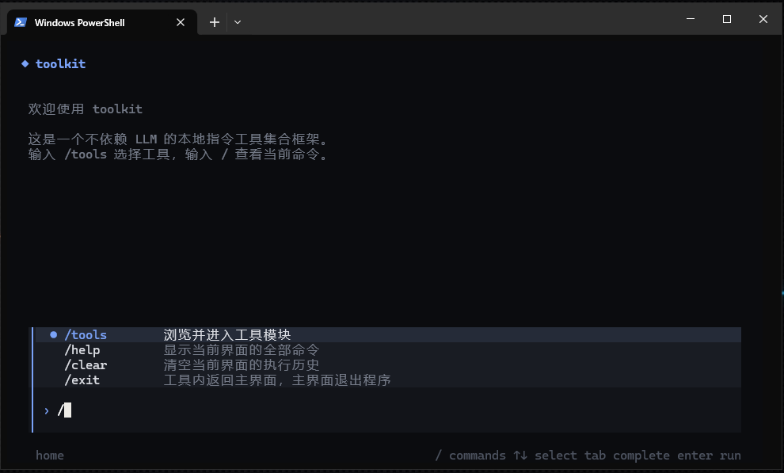
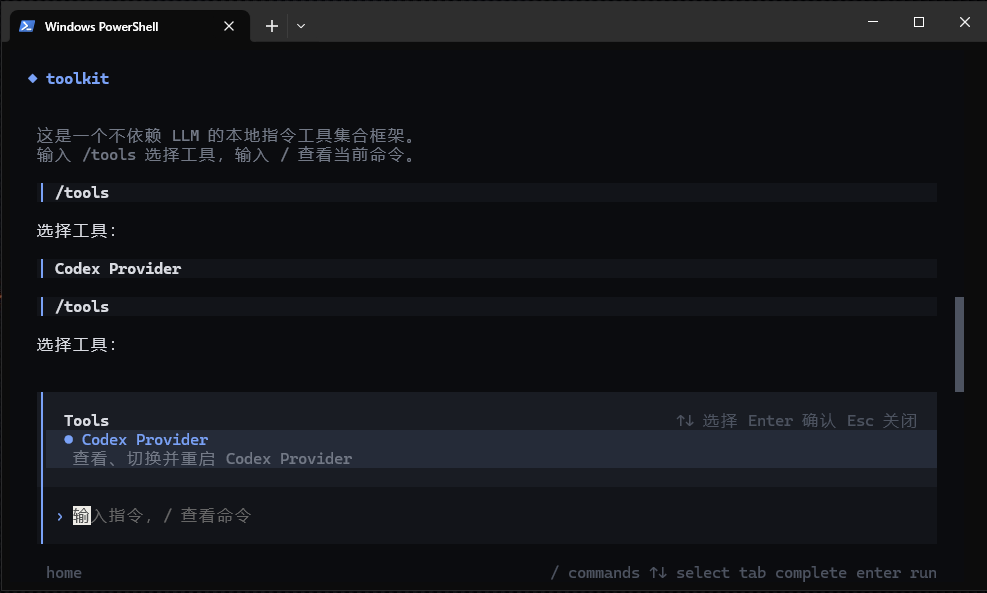
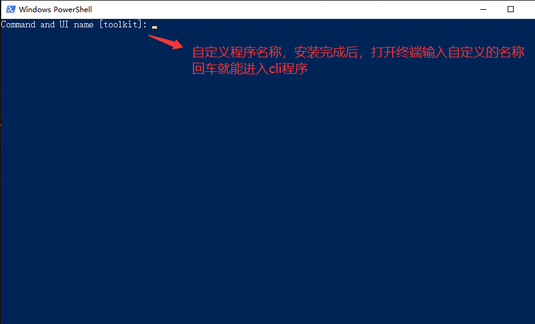

# cli-toolkit-fw

Current version: `1.0.0`

`cli-toolkit-fw` 是一个可由 AI 协助定制的交互式 CLI 工具集合框架。它保留 OpenCode 风格的输入、命令补全、列表选择、导航、历史输出和鼠标滚动，但运行时不连接 LLM。

用户只需向代码型 AI 描述想要的工具和命令。AI 按照仓库中的 `AGENTS.md` 和 `docs/` 规范生成本地 TypeScript 工具，之后所有操作都由本地代码直接执行。

本仓库只包含通用框架，不包含任何特定服务、账号、额度查询、配置切换或进程管理业务。

## 界面预览

### 主界面与命令提示

  输入 `/` 后显示当前作用域的命令，可以使用方向键选择、`Tab` 补全并按 `Enter` 执行。命令名后输入空格可继续用 `Tab` 补全参数（需命令支持）。



### 自动发现本地扩展

把工具放入 `extensions/` 后，框架会在 `/tools` 中自动显示。下面的业务工具仅用于演示本地扩展效果，不包含在公共仓库中。



## 安装

Windows：

```powershell
powershell -ExecutionPolicy Bypass -File .\install-windows.ps1
```

Linux 或 macOS：

```bash
chmod +x ./install.sh
./install.sh
```

安装时会要求输入命令与 UI 名称，直接回车则使用默认名称 `toolkit`。例如输入 `mytools` 后，启动命令和界面标题都会变成 `mytools`。



Windows 安装器会广播 PATH 更新并验证命令入口。如果 Windows Terminal 在安装前已经运行，仅新建标签页可能仍继承旧 PATH；需要关闭全部 Windows Terminal 窗口后重新打开。

安装完成并重新打开终端后，使用安装时选择的名称运行。默认是：

```text
toolkit
```

卸载会删除框架写入的 PATH、环境变量、项目内由安装器生成的 `.cli-toolkit-fw/` 启动器目录和 `node_modules/` 依赖目录；不会删除 Bun、源码、扩展、扩展配置或日志。需要恢复依赖时重新运行安装脚本即可。交互式卸载完成后会等待任意键退出：

```powershell
powershell -ExecutionPolicy Bypass -File .\uninstall-windows.ps1
```

```bash
chmod +x ./uninstall.sh
./uninstall.sh
```

## MCP 服务器（AI 工具调用）

框架内置 MCP（Model Context Protocol）服务器，把 `extensions/` 中自动发现的工具注册为 MCP tools，供 AI 客户端（豆包工作任务与定时任务、Claude Code、Cursor 等支持 MCP 的客户端）以标准方式发现和调用。工具调用返回现有 CLI 终端输出格式，不做平台转换。

### 入口模式

框架支持三种非交互入口，其余任何调用都进入交互式终端 UI：

```text
toolkit server start                        # MCP stdio 服务器模式（供 AI 客户端 spawn）
toolkit server stop                         # 停止本机手动启动的调试实例
toolkit --run <工具ID> <命令名> [参数...]   # 单次执行一条命令，打印文本结果后退出
```

- `server start` 是 MCP 服务器模式：被 AI 客户端作为启动命令 spawn 时，进程进入服务模式，通过 stdin/stdout 走 JSON-RPC（`initialize` → `tools/list` → `tools/call`），处理完一次请求继续等待下一条，直到客户端关闭 stdin（EOF）才退出。进程生命周期由客户端管理，正常流程无需手动停止；`server stop` 仅用于清理本机手动启动或异常残留的调试实例。
- `--run` 是单次执行模式：把一条命令当作普通 CLI 运行，执行完打印文本并退出，适合脚本调用与人工验证。例如 `toolkit --run my-tool status`。列表选择、导航等交互式结果会自动渲染为可读文本，不会打开终端 UI。

两种模式共用同一套命令执行核心（`src/core/runner.ts`），行为完全一致：MCP 客户端调用 `codex-provider.autosign` 与执行 `toolkit --run codex-provider autosign suoxie` 是同一路径。

### 豆包工作任务接入

在豆包工作任务「技能」→「连接器」中新建自定义连接器：

| 字段 | 填写 |
|---|---|
| 服务器名称 | `toolkit` |
| 传输类型 | `STDIO` |
| 命令 | `bun.exe` 的绝对路径（本机实测：`C:\Users\jiangcheng_m.CYOU-INC\AppData\Roaming\npm\node_modules\bun\bin\bun.exe`；注意 PATH 中的 `bun` 常为 npm 的 `.cmd`/`.ps1` 包装，客户端无法直接 spawn，必须填原生可执行文件） |
| 参数 | `run`、`<项目根目录>\src\index.tsx`、`server`、`start` |
| 环境变量 | 不填 |

保存后，豆包工作任务会在本地电脑 spawn 该进程并完成 MCP 握手，连接器暴露的工具即可在对话或定时任务中直接调用。

工具命名约定：每个扩展命令自动注册为 MCP 工具 `<工具ID>.<命令名>`（例如 `codex-provider.autosign`）。工具输入是一个 `args: string[]` 参数——AI 调用时传 `arguments: { "args": ["suoxie"] }`，等价于终端里执行 `/autosign suoxie` 或 `toolkit --run codex-provider autosign suoxie`。

注意：自定义连接器仅支持在本地电脑使用；调用依赖本机文件（token、脚本、配置）的任务，需在豆包工作任务中选择「本地电脑」设备。

### 格式转换约定

MCP 工具统一返回 CLI 终端输出。需要飞书等平台格式时，由调用方（AI）执行预先写好的转换脚本完成，不在工具内部做平台转换。

## 让 AI 快速定制工具

这个仓库专门面向「用 AI 定制工具」：安装后向任何能读写本仓库的代码型 AI 描述需求，AI 会按仓库内置契约（`AGENTS.md` + `docs/`）生成本地扩展。全部逻辑落在 `extensions/` 下，框架自动发现，无需改框架源码、无需注册表。

### 工作流

1. **描述需求**：告诉 AI 工具用途、命令名、行为，尽量带具体例子（如"签到后显示每个账号的金额和连续天数"）。
2. **AI 实现**：AI 会读 `AGENTS.md` 与 `docs/CREATE_TOOL.md`，在 `extensions/<工具ID>/` 下用 `defineCommand` / `defineTool` 写代码，补测试和工具自身的 README。
3. **验收**：AI 运行 `bun run typecheck` 和 `bun test`，全部通过才算完成。
4. **使用**：重启框架进入 `/tools` 查看新工具；命令同时自动暴露为 MCP 工具 `<工具ID>.<命令名>`，也可用 `toolkit --run <工具ID> <命令名> [参数...]` 单次执行验证。

### 示例指令

```text
请阅读 AGENTS.md 和 docs/CREATE_TOOL.md，在 extensions 文件夹中为这个 CLI 添加一个 Git 工具。
需要 /status、/branches 和 /checkout 命令。
选择分支时使用方向键列表，完成后运行 bun run typecheck 和 bun test。
```

### 定制规范速览

- 工具与全部业务逻辑放 `extensions/<工具ID>/`，禁止放 `src/`；`index.ts` 默认导出 `defineTool(...)` 结果，框架自动发现。
- 命令用 `defineCommand` 定义，返回 `CommandResult`（`output` / `selection` / `navigate` / `clear` / `exit`）。
- 每条命令自动成为 MCP 工具 `<工具ID>.<命令名>`：面向 AI 调用时保持幂等、把完整结果放 `result.output`。
- 扩展测试放 `extensions/<工具ID>/test/`；配置或命令变化必须同步更新工具自身 README。
- `extensions/` 内容默认被 Git 忽略，个人工具与密钥不会推送到远程。

详细规则见：

- `docs/CREATE_TOOL.md` —— 从零创建工具的完整步骤与 MCP 行为
- `docs/EXTENSIONS.md` —— 扩展目录规范与 MCP 自动注册
- `docs/COMMAND_API.md` —— 命令契约、结果类型、参数补全、外部进程
- `docs/ARCHITECTURE.md` —— 分层结构与 headless 执行（MCP server / `--run`）
- `docs/SECURITY.md` —— 凭据与敏感操作规则
- `docs/TESTING.md` —— 测试规范

## 默认交互

- `/tools`：查看并进入已注册工具
- `/help`：显示当前作用域的命令
- `/clear`：清空当前作用域的输出历史
- `/exit`：工具内返回主页，主页退出程序

`Ctrl+C` 不用于退出程序。界面中存在选中文本时，`Ctrl+C` 复制所选内容；没有选中文本时不会执行退出操作。请使用 `/exit` 返回主页或关闭程序。
- `Ctrl+A`：全选输入框文本
- `↑` / `↓`：选择命令或列表项
- `Tab`：补全命令或参数
- `Enter`：执行或确认
- `Esc`：关闭选择列表或清空输入
- 鼠标滚轮：滚动历史输出

所有用户扩展必须放在根目录的 `extensions/<工具ID>/` 中，并从 `index.ts` 默认导出工具。框架启动时会自动发现，无需修改注册表。删除某个工具目录后，该工具会在下次启动时消失；删除整个 `extensions/` 后会回到没有业务工具的默认框架状态。

`extensions/` 内的用户工具默认全部被 Git 忽略，仓库只跟踪 `extensions/.gitkeep`。这可以防止本地工具、账号配置和特定机器逻辑被意外推送到远程仓库。

框架默认不提供业务工具。`examples/basic-tool/` 只用于向开发者和 AI 展示正确写法，不会被自动加载。

## 开发验证

```text
bun run typecheck
bun test
```

## 版本管理

项目使用语义化版本：

```text
主版本.次版本.修订版本
```

- 不兼容的框架变化增加主版本。
- 向后兼容的新能力增加次版本。
- 向后兼容的问题修复增加修订版本。

版本号记录在 `package.json`，每个版本的具体变化记录在 `CHANGELOG.md`，正式版本使用 `v<版本号>` Git 标签。

日志位置：

- Windows：`%LOCALAPPDATA%\cli-toolkit-fw\logs\cli-toolkit-fw.log`
- macOS：`~/Library/Logs/cli-toolkit-fw/cli-toolkit-fw.log`
- Linux：`${XDG_STATE_HOME:-~/.local/state}/cli-toolkit-fw/cli-toolkit-fw.log`
